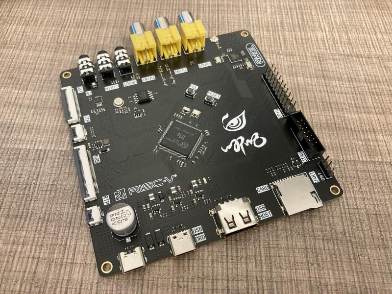
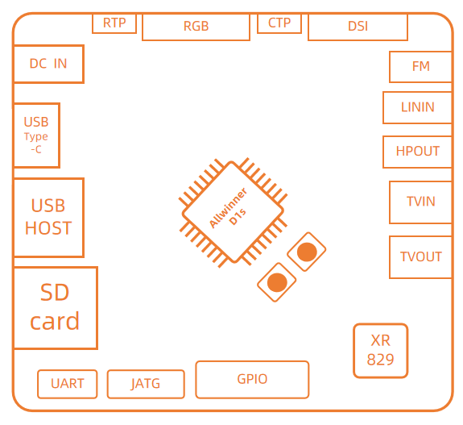

# Nezha-D1s
[AWOL x YuzukiHD] Official D1s EVB board

## About

The Nezha D1s development board is a EVB based on the Allwinner D1s chip design. Licensed under [CERN Open Hardware Licence Version 2 - Strongly Reciprocal](https://spdx.org/licenses/CERN-OHL-S-2.0.html)

- Support RGB display interface;
- Support DSI interface;
- Support TP interface;
- Support LINEIN interface, support HPOUT interface;
- Support TVIN/TVOUT interface;
- Support FM radio;
- Integrated Allwinner XR829 WiFi/BT chip;
- Support JATG/UART debug;
- Support SD Card / NOR / NAND Flash Boot;
- Support USB Host/Device;
- Tina Linux / Buildroot(YuzukiSBC) / RTOS

It can be used for chip evaluation, program pre-research and personal DIY, and can be applied to product forms such as game consoles, smart commercial displays, HMI, and smart central control.

## Guides

[Quick Start](docs/QuickStart.md)

[Buildroot](docs/Buildroot.md)

## D1s

D1s is a cost-effective AIoT chip designed by Allwinner for the intelligent decoding market. It uses a 64bit RISC-V ISA Alibaba T-Head C906 CPU, built-in 64M DDR2, supports Linux system, and integrates a large number of self-developed audio and video related IP, which can support full format decoding such as H.265, H.264, MPEG-1 /2/4, JPEG. D1s supports ADC/DAC/I2S/PCM/DMIC/OWA and other audio interfaces. It can be widely used in smart home panels, HMI, industrial control, smart cars and other products.

## Links

AWOL Documents (Chinese): https://d1s.docs.aw-ol.com/  

Announcement Post (Chinese): https://bbs.aw-ol.com/topic/1257/

